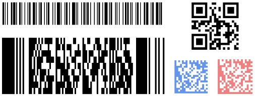

# SGKBarcodeBundle

[](https://travis-ci.org/shangguokan/SGKBarcodeBundle)
[](https://packagist.org/packages/sgk/barcode-bundle)
[](https://packagist.org/packages/sgk/barcode-bundle)
[](https://packagist.org/packages/sgk/barcode-bundle)

SGKBarcodeBundle is the Symfony2 Barcode Generator Bundle which you want! this README is also available in French and Chinese.

Features:

1. Support 3 two-dimensional and 30 one-dimensional Barcode types
2. Output three formats: HTML, PNG, or SVG canvas
3. Twig integration: you can simply use a function extensional of Twig in the template to generate Barcode
4. Core of this bundle use this laravel project: [dinesh/barcode](https://github.com/dineshrabara/barcode)



## Installation

Add SGKBarcodeBundle by running the command:

```sh
$ php composer.phar require sgk/barcode-bundle: dev-master
```
Composer will install the bundle to your project's vendor/sgk directory.

Then, Enable the bundle in the kernel:

```php
<?php
// app/AppKernel.php

public function registerBundles()
{
    $bundles = array(
        // ...
        new SGK\BarcodeBundle\SGKBarcodeBundle(),
    );
}
```

## Generate options

To generate a barcode, you have 5 options can be configured.

|option|type   |required|allowed values|desccription                |
|------|:-----:|:------:|:------------:|:---------------------------:|
|code  |string |required|              |what you want encoded|
|type  |string |required|[Read Supported Types](#supported-barcode-types)|type of barcode|
|format|string |required|html, svg, png|output format|
|width |**integer**|optional|              |width of units|
|height|**integer**|optional|              |height of units|
|color |string for html, svg / array for png|optional|[HTML Color Names](http://www.w3schools.com/html/html_colornames.asp) / array(R, G, B)|Barcode color|

> Default width and height for two-dimensional are 5, 5, for one-dimensional are 2, 30.
> Default color for html,svg is black, for png is array(0, 0, 0)

## Usage with service
  
The bundle registers one service: ``sgk_barcode.generator`` which will allows you to generate barcode:

* outpout html
```php
$options = array(
    'code'   => 'string to encode',
    'type'   => 'c128',
    'format' => 'html',
);

$barcode =
    $this->get('sgk_barcode.generator')->generate($options);
    
echo $barcode;
```

* outpout svg
```php
$options = array(
    'code'   => 'string to encode',
    'type'   => 'qrcode',
    'format' => 'svg',
    'width'  => 10,
    'height' => 10,
    'color'  => 'green',
);

$barcode =
    $this->get('sgk_barcode.generator')->generate($options);
    
echo $barcode;
```

* outpout png
```php
$options = array(
    'code'   => 'string to encode',
    'type'   => 'datamatrix',
    'format' => 'png',
    'width'  => 10,
    'height' => 10,
    'color'  => array(127, 127, 127),
);

$barcode =
    $this->get('sgk_barcode.generator')->generate($options);
    
echo '';
```
> For format png, the generator return the based64 of png file, so we use [Data URI scheme](http://en.wikipedia.org/wiki/Data_URI_scheme) to display the png in webpage.

## Usage in Twig template

This bundle extend one function of Twig ``barcode`` which you can simply use it to generate barcode in the twig template.

``barcode`` Twig fuction use the same options as the service function before, the only diffrent is your need pass a [Twig array](http://twig.sensiolabs.org/doc/templates.html#literals) in the function.

* display html

```twig
{{ barcode({code: 'string to encode', type: 'c128', format: 'html'}) }}
```

* display svg

```twig
{{ barcode({code: 'string to encode', type: 'qrcode', format: 'svg', width: 10, height: 10, color: 'green'}) }}
```

* display png

```twig

```

## Save Barcode in file

coming soon

## Supported Barcode Types

Please read [Wikipedia page](http://en.wikipedia.org/wiki/Barcode) to know which type you should choice. 

### 2d barcodes

1. qrcode
2. pdf417
3. datamatrix

### 1d barcodes

1. c39
2. c39+
3. c39e
4. c39e+
5. c93
6. s25
7. s25+
8. i25
9. i25+
10. c128
11. c128a
12. c128b
13. c128c
14. ean2
15. ean5
16. ean8
17. ean13
18. upca
19. upce
20. msi
21. msi+
22. postnet
23. planet
24. c3rms4cc
25. kix
26. imb
27. codabar
28. code11
29. pharma
30. pharma2t

## Requirements

If there is some problem of Requirements, make sure you have install these two extensions of PHP (check in your phpinfo()).

- Barcodes requires [ImageMagick](http://php.net/manual/en/book.imagick.php) to create PNGs in PHP 5.3.
- Barcodes requires [PHP bcmath](http://php.net/manual/en/book.bc.php) extension for Intelligent Mail barcodes

## Tests
